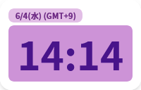
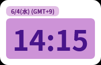
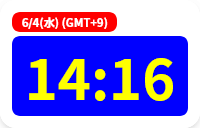
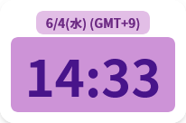
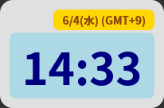

# datatime.html

`datatime.html` は、現在の日付と時刻をシンプルに表示するウェブアプリケーションです。OBSなどの配信ツールでのオーバーレイ表示や、デスクトップのカスタマイズなど、様々な用途で活用できます。

## 使い方

1. このリポジトリをクローンまたはダウンロードします。

2. `index.html` ファイルをウェブブラウザで開きます。

## カスタマイズ

URLパラメータを使用することで、表示される日付と時刻の背景色、文字色、配置を柔軟にカスタマイズできます。

### 利用可能なパラメータ

* **`bgColor`**: ページ全体の背景色。

  * 例: `bgColor=000000` (黒), `bgColor=red`

* **`containerBgColor`**: メインコンテナの背景色。

  * 例: `containerBgColor=FFFFFF` (白)

* **`dateBgColor`**: 日付表示部分の背景色。

  * 例: `dateBgColor=E2BEE6`

* **`dateTextColor`**: 日付表示部分の文字色。

  * 例: `dateTextColor=6D2A84`

* **`timeBgColor`**: 時刻表示部分の背景色。

  * 例: `timeBgColor=CD93D7`

* **`timeTextColor`**: 時刻表示部分の文字色。

  * 例: `timeTextColor=48148A`

* **`dateAlign`**: 日付表示のテキストアラインメント。

  * 値: `left`, `center`, `right`

**色の指定について:**
色の値は、`RRGGBB`形式の16進数コード（例: `FF0000`）またはCSSのカラーネーム（例: `red`）で指定できます。

### URLパラメータの例

以下のURLの例は、`https://murahito130.github.io/datetime.html` をベースにしています。

1. **デフォルト設定 (パラメータなし):**
   `https://murahito130.github.io/datetime.html`

   **表示例:**
   

2. **背景色を黒、メインコンテナの背景色を白に設定:**
   `https://murahito130.github.io/datetime.html?bgColor=000000&containerBgColor=FFFFFF`

   **表示例:**
   

3. **日付表示の背景を赤、文字を白に、時刻表示の背景を青、文字を黄色に設定:**
   `https://murahito130.github.io/datetime.html?dateBgColor=FF0000&dateTextColor=FFFFFF&timeBgColor=0000FF&timeTextColor=FFFF00`

   **表示例:**
   

4. **日付を中央揃えに設定:**
   `https://murahito130.github.io/datetime.html?dateAlign=center`

   **表示例:**
   

5. **すべてのパラメータを組み合わせて設定:**
   `https://murahito130.github.io/datetime.html?bgColor=333333&containerBgColor=E0E0E0&dateBgColor=FFD700&dateTextColor=8B4513&timeBgColor=ADD8E6&timeTextColor=000080&dateAlign=right`

   **表示例:**
   
